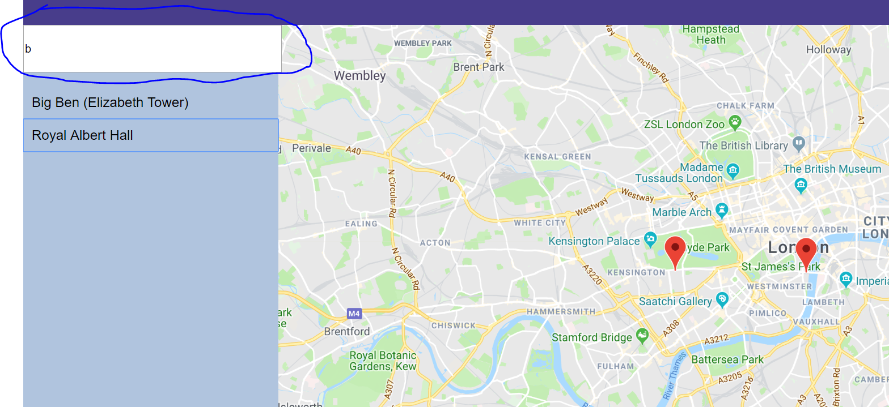

Neighborhood Map
===

This app was build using create-react-app (https://github.com/facebook/create-react-app) and uses the react-google-maps(https://github.com/tomchentw/react-google-maps) library.
To see the live version of the app, click https://pikabe.github.io/neighbourhood-map/ .

App Description
---
This application allows user to access information (provided by the foursquare API) about five different locations in London. Markers are rendered onto a map(provided by the google maps API) at the coordinates of the locations and a sidebar lists the names of the locations. Each location's information can be accessed by clicking on the markers which are rendered on the map (rendered using the google maps API) at the coordinates of the Locations and markers can be filtered using the input provided in the sidebar and when a location is chosen, an infobox opens at the location's position on the map with information about the chosen location.

Installation and Configuration
---

To download this app,
1) Click the Clone or Download button then Download Zip.
2) Once downloaded, open the project's terminal and run the following commands,
```
npm install

```
```
npm install -g serve

```
```
serve -s build

```
3) navigate to http://localhost:5000/ to view the app.

Usage
---
Filter locations using the input provided.



To choose a location, click on the name of the location on the sidebar or click the marker at the location's position on the map. The center of the map would be changed to the coordinate of the location on the map. The marker of the chosen location will animate and an infobox will open displaying the address of the chosen location.


To undo this, click on the location again (this will also move the center of the map to the default center) or to choose another location, click on the new location's name or marker.

On smaller screens click on the hamburger icon appears to hide or display the sidebar.


External API used
---
foursquare https://developer.foursquare.com/places-api
